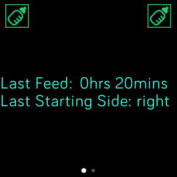
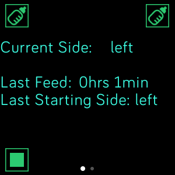
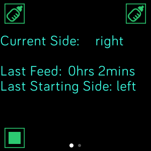
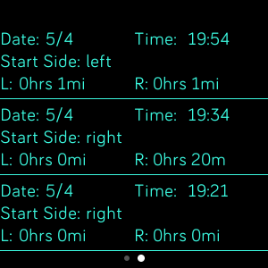

# BabyFeed

A Breast Feeding logging Fitbit Versa 2 app to help new moms with breast feeding. The app will record up to 25 feeding, including the time, start side, and the amount of time each side was used.

## Use

Start by pressing the bottle in the upper left or upper right corner (depending on what side is being started on). Then evey time a side is switched press the button in the other top corner. Once finished press the stop button in the lower left corner. 

## Repo
[GITHUB](https://github.com/andydmort/BabyFeed)

### Thanks
- Special thanks to icons8.com for the Baby Bottle Icons and the stop icon. 

<a target="_blank" href="https://icons8.com/icons/set/baby-bottle">Baby Bottle icon</a> icon by <a target="_blank" href="https://icons8.com">Icons8</a>

<a target="_blank" href="https://icons8.com/icons/set/baby-bottle">Baby Bottle icon</a> icon by <a target="_blank" href="https://icons8.com">Icons8</a>

<a target="_blank" href="https://icons8.com/icons/set/stop">Stop icon</a> icon by <a target="_blank" href="https://icons8.com">Icons8</a>

- Also thanks to tanstaaflFH who had a similar project to this one. [BabyLog](https://github.com/tanstaaflFH/BabyLog)